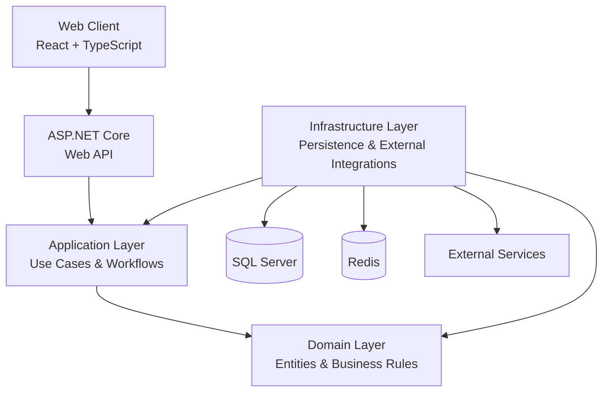
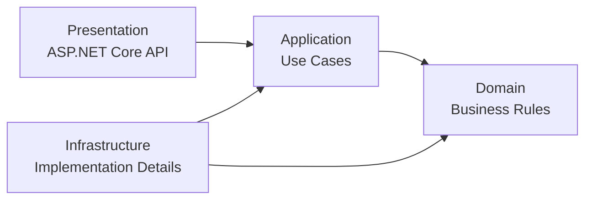

# System Architecture

## 1. Architectural Style

The Enterprise Order & Inventory Platform will initially be implemented as a **modular monolith** using **Clean Architecture principles**.

The system will remain a single deployable application while maintaining clear boundaries between business modules and architectural layers.

The architecture will evolve as the system develops. Significant architectural changes will be documented and reviewed through version control and Architecture Decision Records (ADRs) when appropriate.

---

## 2. Why a Modular Monolith?

The initial system does not require the operational complexity of a distributed microservices architecture.

A modular monolith allows us to establish:

* Clear business boundaries
* High cohesion
* Low unnecessary coupling
* Simple deployment
* Straightforward local development
* Strong testability
* Easier debugging and observability

Microservices may be considered later if specific scalability, organizational, deployment, reliability, or domain-boundary requirements justify the additional complexity.

The decision to introduce distributed services must be based on actual system requirements rather than technology trends.

---

## 3. High-Level System Architecture

---

## 4. Architectural Layers

### 4.1 Domain Layer

The Domain layer contains the core business concepts and business rules of the system.

It should remain independent of infrastructure and presentation technologies.

The Domain should not directly depend on:

* ASP.NET Core
* Entity Framework Core
* SQL Server
* Redis
* External APIs

The objective is to keep business rules independent from implementation details.

---

### 4.2 Application Layer

The Application layer contains application use cases and business workflows.

Its responsibilities include:

* Coordinating application operations
* Orchestrating domain objects
* Defining application-level abstractions
* Coordinating interactions between domain capabilities and infrastructure abstractions

The Application layer depends on the Domain layer.

---

### 4.3 Infrastructure Layer

The Infrastructure layer contains implementation details and integrations with external systems.

Potential responsibilities include:

* Entity Framework Core
* SQL Server persistence
* Redis caching
* External service integrations
* Messaging infrastructure
* Background processing infrastructure

Infrastructure implementations should satisfy abstractions required by the Application or Domain layers.

---

### 4.4 Presentation Layer

The Presentation layer exposes the system through the ASP.NET Core Web API.

Responsibilities include:

* HTTP request handling
* Request and response models
* API endpoint exposure
* Authentication and authorization integration
* Input validation at the API boundary
* HTTP response handling

---

## 5. Dependency Direction

The architecture will follow a dependency direction toward the core business logic.

The Domain layer should remain independent from external infrastructure and presentation technologies.

---

## 6. Initial Business Modules

The initial system will contain the following major business areas:

| Module            | Primary Responsibility                        |
| ----------------- | --------------------------------------------- |
| Identity & Access | Authentication, authorization and user access |
| Customers         | Customer profiles and customer information    |
| Products          | Product catalogue and product management      |
| Inventory         | Stock, reservations and inventory adjustments |
| Orders            | Order creation and order lifecycle            |
| Payments          | Payment processing and payment state          |
| Fulfillment       | Picking, packing and fulfillment operations   |
| Shipments         | Shipment creation and tracking                |
| Notifications     | Customer and operational notifications        |
| Reporting         | Operational and business reporting            |

These modules will initially exist within the same deployable application.

---

## 7. High-Level Business Flow

The primary order lifecycle is:

```mermaid
flowchart LR
    Customer["Customer"]
    Products["Product Selection"]
    Order["Order Creation"]
    Inventory["Inventory Reservation"]
    Payment["Payment"]
    Confirmation["Order Confirmation"]
    Fulfillment["Fulfillment"]
    Shipment["Shipment"]
    Delivery["Delivery"]

    Customer --> Products
    Products --> Order
    Order --> Inventory
    Inventory --> Payment
    Payment --> Confirmation
    Confirmation --> Fulfillment
    Fulfillment --> Shipment
    Shipment --> Delivery
```

This represents the initial conceptual workflow. Detailed order-state transitions and failure-handling flows will be designed separately.

---

## 8. Architectural Goals

The architecture should prioritize:

* **Maintainability** — the system should remain understandable as it grows.
* **Testability** — business logic should be testable independently of infrastructure.
* **Security** — access to functionality and sensitive operations should be controlled.
* **Reliability** — failures should be handled gracefully.
* **Scalability** — the system should be capable of handling increased traffic.
* **Observability** — engineers should be able to understand system behavior.
* **Low coupling** — components should have minimal unnecessary dependencies.
* **High cohesion** — related responsibilities should remain together.

---

## 9. Architectural Evolution

The initial architecture will remain a modular monolith.

As the system evolves, architectural decisions may change based on:

* New functional requirements
* Performance requirements
* Scalability constraints
* Reliability requirements
* Security requirements
* Operational requirements
* Domain-boundary discoveries

When a significant architectural decision changes, the relevant documentation will be updated and an Architecture Decision Record (ADR) will be created when appropriate.

The repository's Git history will preserve the evolution of the architecture over time.
