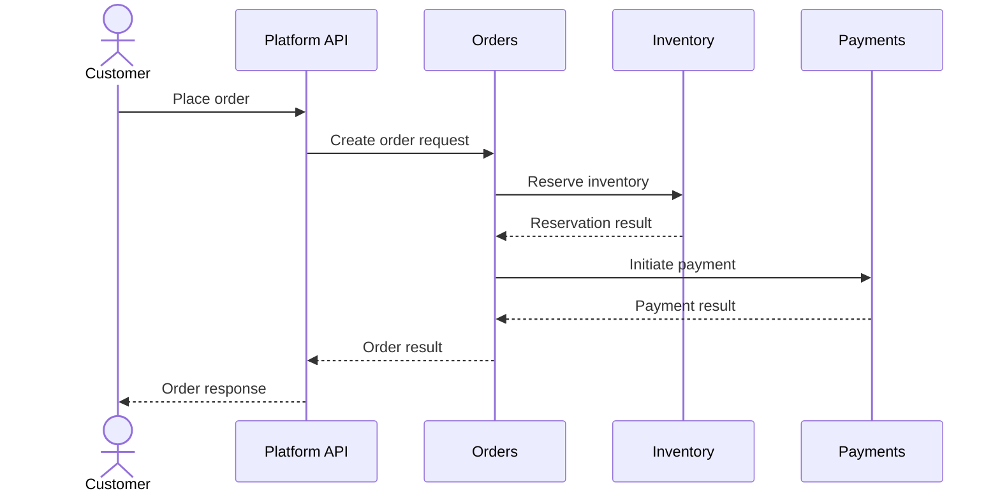

# Use Cases

## 1. Purpose

This document defines the primary actors and business goals supported by the Enterprise Order & Inventory Platform.

A use case represents a meaningful business goal or interaction with the system. It is intentionally independent of specific implementation details such as API endpoints, classes, or database operations.

The use-case model will evolve as additional requirements and business scenarios are discovered.

---

## 2. Actors

The system interacts with both human users and external systems.

### Human Actors

* Customer
* Administrator
* Inventory Manager
* Warehouse Staff
* Finance Staff

### External System Actors

* Payment Provider
* Shipping Provider
* Notification Provider

---

## 3. Customer Use Cases

| Use Case                    | Description                                                   |
| --------------------------- | ------------------------------------------------------------- |
| Register Account            | Create a customer account                                     |
| Browse Products             | View available products and product information               |
| Add Products to Cart        | Add products and quantities to a shopping cart                |
| Manage Checkout Information | Provide or update information required during checkout        |
| Place Order                 | Submit an order for the selected products                     |
| View Order Status           | View the current state of an order                            |
| Cancel Eligible Order       | Request cancellation of an order when business rules allow it |
| Track Shipment              | View shipment and delivery tracking information               |

---

## 4. Administrator Use Cases

| Use Case                 | Description                                                                          |
| ------------------------ | ------------------------------------------------------------------------------------ |
| Manage User Accounts     | View, update, activate, or deactivate user accounts according to authorization rules |
| Manage Products          | Create, update, or deactivate products                                               |
| Monitor System Activity  | Review relevant operational activity                                                 |
| View Operational Reports | Review system and business reports available to administrators                       |

---

## 5. Inventory Manager Use Cases

| Use Case                      | Description                                                              |
| ----------------------------- | ------------------------------------------------------------------------ |
| View Inventory                | View current inventory levels                                            |
| Receive Stock                 | Record newly received inventory                                          |
| Adjust Inventory              | Correct inventory quantities according to authorized business procedures |
| Manage Inventory Reservations | Review and manage inventory reservations                                 |
| View Inventory History        | Review inventory adjustments and reservation history                     |

---

## 6. Warehouse Staff Use Cases

| Use Case                      | Description                                                                 |
| ----------------------------- | --------------------------------------------------------------------------- |
| View Fulfillment Tasks        | View orders requiring warehouse fulfillment                                 |
| Pick Items                    | Pick required products for an order                                         |
| Pack Order                    | Prepare picked items for shipment                                           |
| Mark Order Ready for Shipment | Indicate that fulfillment is complete and the order can proceed to shipment |
| Update Fulfillment Status     | Record relevant fulfillment state changes                                   |

---

## 7. Finance Staff Use Cases

| Use Case                  | Description                                  |
| ------------------------- | -------------------------------------------- |
| View Payment Transactions | Review payment transactions                  |
| Review Payment Status     | Investigate payment states and outcomes      |
| Process Refund            | Initiate an authorized refund                |
| View Payment Reports      | Review financial and payment-related reports |

---

## 8. External System Interactions

### Payment Provider

The platform may interact with an external payment provider to:

* Initiate payment processing
* Receive payment results
* Process payment status notifications or webhooks

### Shipping Provider

The platform may interact with an external shipping provider to:

* Create shipments
* Obtain tracking information
* Receive shipment and delivery status updates

### Notification Provider

The platform may interact with an external notification provider to:

* Deliver email notifications
* Deliver other supported customer notifications

---

## 9. Primary Order Use Case

The primary customer workflow is placing an order.

This is an initial conceptual flow. Detailed failure handling, transaction boundaries, payment processing behavior, and asynchronous workflows will be designed separately.

---

## 10. Use-Case Boundaries

Use cases describe **business goals**, not implementation details.

For example:

> **Place Order**

is a business use case.

The implementation may involve:

* API endpoints
* Application services
* Domain entities
* Inventory reservation
* Payment processing
* Database transactions
* Events
* Notifications

These implementation details should not be treated as separate customer use cases.

---

## 11. Evolution

The use-case model will evolve as the system develops.

New use cases or changes may result from:

* New business requirements
* Security requirements
* Operational requirements
* Domain discoveries
* User feedback
* Additional system integrations

Significant changes should be reflected in the appropriate documentation and Git history.
