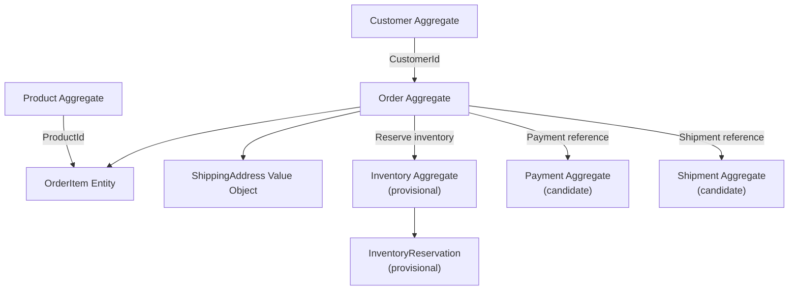

# Domain Model

## 1. Purpose

This document defines the initial domain model for the Enterprise Order & Inventory Platform.

The domain model identifies important business concepts, their responsibilities, relationships, and initial aggregate boundaries.

The model is intentionally evolutionary. Aggregate boundaries and domain responsibilities may change as additional business rules and system behavior are discovered.

---

## 2. Domain Modeling Principles

The domain model follows these initial principles:

* Business concepts should have clearly defined responsibilities.
* Aggregates should protect their own consistency boundaries.
* Aggregates should not directly modify the internal state of other aggregates.
* Relationships between aggregates should generally be represented through identity rather than direct object ownership.
* Value Objects should be used where identity is not important and the value itself defines the concept.
* Business rules should be associated with the domain concept that owns the relevant state.
* Domain modeling should be driven by business behavior rather than database structure.

---

## 3. Initial Domain Concepts

The initial domain contains the following major concepts:

* Customer
* Product
* Order
* OrderItem
* Inventory
* InventoryReservation
* Payment
* Shipment
* Money
* ShippingAddress

---

## 4. Initial Classification

| Concept              | Initial Classification                 | Reason                                                                                         |
| -------------------- | -------------------------------------- | ---------------------------------------------------------------------------------------------- |
| Customer             | Aggregate Root                         | Has independent identity and lifecycle                                                         |
| Product              | Aggregate Root                         | Has independent identity and product lifecycle                                                 |
| Order                | Aggregate Root                         | Owns the order lifecycle and order consistency rules                                           |
| OrderItem            | Entity                                 | Has identity within the Order aggregate but does not independently own the order lifecycle     |
| ShippingAddress      | Value Object                           | Address value is more important than independent identity within an order                      |
| Money                | Value Object                           | Represents a monetary value and currency rather than an independently tracked business entity  |
| Inventory            | Aggregate boundary under investigation | Exact inventory consistency boundary depends on warehouse, stock, and reservation requirements |
| InventoryReservation | Domain entity under investigation      | Represents a reservation with its own state and lifecycle                                      |
| Payment              | Aggregate Root candidate               | Has identity, transaction state, and an independent payment lifecycle                          |
| Shipment             | Aggregate Root candidate               | Has identity, shipment state, and an independent fulfillment lifecycle                         |

---

## 5. Customer Aggregate

The Customer aggregate represents the customer's account and customer-specific business state.

### Initial model

```text
Customer
├── CustomerId
├── Name
├── Email
├── Account Status
└── Customer-specific information
```

Customer is treated as an Aggregate Root.

Other aggregates should reference a customer through `CustomerId` rather than holding the complete Customer aggregate.

---

## 6. Product Aggregate

The Product aggregate represents product information and product lifecycle state.

### Initial model

```text
Product
├── ProductId
├── SKU
├── Name
├── Description
├── Current Price
└── Product Status
```

Product owns current product information.

Inventory information should not be treated as part of the Product aggregate simply because inventory refers to a product.

---

## 7. Order Aggregate

The Order aggregate represents the customer's order and controls the order lifecycle.

### Initial model

```text
Order
├── OrderId
├── CustomerId
├── Status
├── OrderItems
│   ├── ProductId
│   ├── ProductName
│   ├── UnitPrice
│   └── Quantity
├── ShippingAddress
└── Order totals
```

Order is an Aggregate Root.

The Order aggregate should not contain the complete Customer or Product aggregates.

Instead, it references external aggregates by identity.

---

## 8. OrderItem

OrderItem represents a product line within an order.

An OrderItem belongs to the Order aggregate and does not independently control the Order lifecycle.

### Initial model

```text
OrderItem
├── OrderItemId
├── ProductId
├── ProductName
├── UnitPrice
└── Quantity
```

The `UnitPrice` represents the price captured for the transaction rather than necessarily referring to the Product's current price.

This allows historical orders to preserve the commercial information that applied when the order was placed.

---

## 9. Product and Order Boundary

The Order aggregate should not directly contain the Product aggregate.

Instead:

```text
Product Aggregate
       │
       │ ProductId
       ▼
Order Aggregate
       │
       └── OrderItem
```

This preserves aggregate boundaries and prevents the Order aggregate from depending on or modifying the internal state of the Product aggregate.

The OrderItem may contain transactional information such as product name and unit price when that information must be preserved as part of the historical order.

---

## 10. Customer and Order Boundary

The Order aggregate should reference the Customer aggregate through `CustomerId`.

```text
Customer Aggregate
       │
       │ CustomerId
       ▼
Order Aggregate
```

The Order does not own or directly modify Customer state.

The Order may contain transaction-specific information such as the shipping address used for that order.

---

## 11. ShippingAddress Value Object

ShippingAddress is initially modeled as a Value Object.

### Initial model

```text
ShippingAddress
├── Street
├── City
├── Province
├── PostalCode
└── Country
```

The address represents the value used for the transaction rather than an independently managed entity within the Order aggregate.

---

## 12. Money Value Object

Money represents a monetary amount together with its currency.

### Initial model

```text
Money
├── Amount
└── Currency
```

Money should be modeled as a Value Object because its value, rather than an independent identity, defines the concept.

Monetary calculations will be designed carefully during implementation to avoid floating-point precision issues.

---

## 13. Inventory Domain

Inventory requires additional analysis before its final aggregate boundaries are established.

Potential concepts include:

```text
Inventory
├── InventoryItem
├── Stock Level
└── InventoryReservation
```

The final model must account for:

* Multiple warehouses
* Available inventory
* Reserved inventory
* Inventory adjustments
* Concurrent order attempts
* Reservation expiration
* Reservation release
* Inventory consistency

The Inventory aggregate boundary will therefore remain provisional until these requirements are modeled in greater detail.

---

## 14. Inventory Reservation

An InventoryReservation represents inventory that has been reserved for an order.

Potential state may include:

```text
InventoryReservation
├── ReservationId
├── OrderId
├── ProductId
├── Quantity
├── Status
├── CreatedAt
└── Expiration information
```

The exact ownership relationship between Inventory and InventoryReservation remains under investigation.

The design must ensure that concurrent orders cannot incorrectly reserve the same available inventory.

---

## 15. Payment Aggregate

Payment is initially considered an Aggregate Root candidate rather than a Value Object.

A payment has its own identity and lifecycle.

Potential state includes:

```text
Payment
├── PaymentId
├── OrderId
├── Amount
├── Currency
├── Status
├── ProviderTransactionId
├── CreatedAt
└── CompletedAt
```

Potential payment states may include:

```text
Pending
    ↓
Authorized
    ↓
Captured
```

or:

```text
Pending
    ↓
Failed
```

Refund and retry behavior will be designed separately.

---

## 16. Shipment Aggregate

Shipment is initially considered an Aggregate Root candidate.

Potential state includes:

```text
Shipment
├── ShipmentId
├── OrderId
├── Status
├── Carrier
├── TrackingNumber
├── ShippingAddress
├── CreatedAt
├── ShippedAt
└── DeliveredAt
```

Potential lifecycle:

```text
Created
   ↓
LabelGenerated
   ↓
Shipped
   ↓
InTransit
   ↓
Delivered
```

Failure states and carrier-specific behavior will be modeled later.

---

## 17. Initial Aggregate Overview



---

## 18. Important Design Decisions

### Decision: Orders reference Customers by identity

Orders use `CustomerId` rather than embedding the complete Customer aggregate.

**Reason:** Customer and Order have separate aggregate boundaries and lifecycles.

### Decision: OrderItems capture transactional product information

OrderItems contain information such as `ProductId` and `UnitPrice`.

**Reason:** Historical orders should preserve the commercial information applicable when the transaction occurred rather than depending on the Product's current state.

### Decision: Aggregates protect their own state

One aggregate should not directly modify another aggregate's internal state.

**Reason:** This reduces coupling and preserves clear consistency boundaries.

---

## 19. Provisional Decisions

The following areas require additional analysis before implementation:

* Exact Inventory aggregate boundary
* InventoryReservation ownership
* Payment aggregate boundaries
* Shipment aggregate boundaries
* Customer address ownership
* Order state machine
* Payment state machine
* Inventory concurrency model
* Cross-aggregate transaction boundaries
* Event-driven interactions

These decisions should be refined as the system design develops.

---

## 20. Evolution

The domain model is expected to evolve as business rules become more precise.

Changes to aggregate boundaries or significant domain decisions should be documented through the appropriate documentation and, where architecturally significant, an Architecture Decision Record (ADR).
